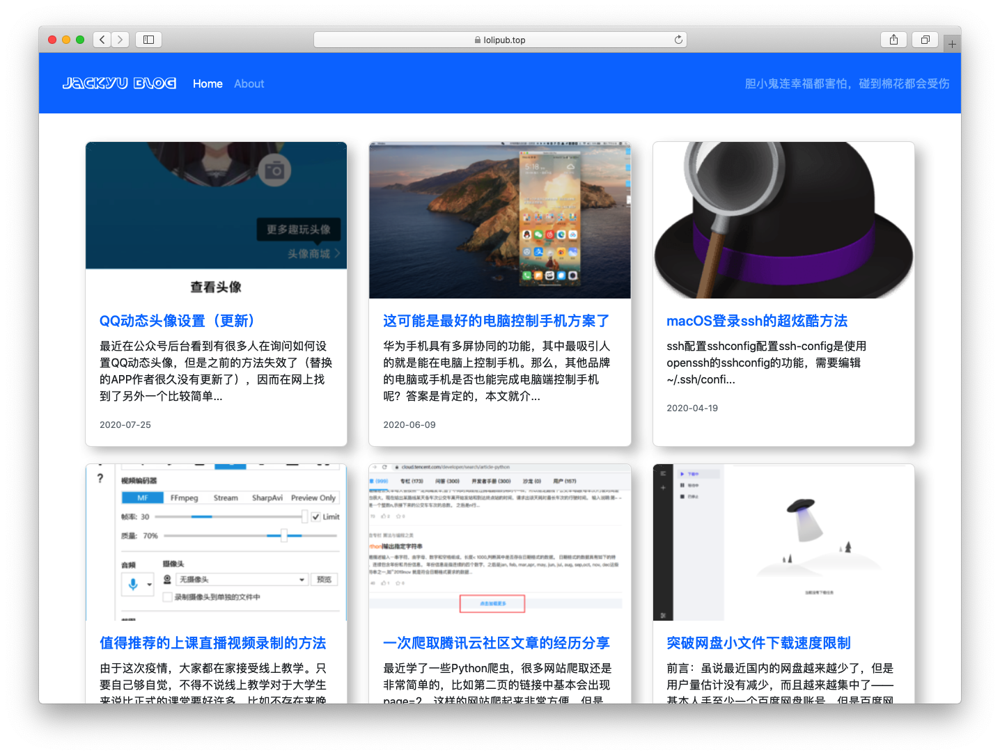

# Jianshu-->Personal blog

English|[中文](README_CN.md)

A personal blog base on [jianshu](https://www.jianshu.com).



## Basic principles

Based on Python3, crawl the information of all articles on Jianshu's personal homepage, write it into `jianshu*.html`, and then load it with ajax.

## Usage

### Edit

* Modify logo_white.png and logo.ico in the img folder to your own logo picture.

* In line 174 of `getInfoFromJianshuApi.py`, modify the `user_id` to your own Jianshu id，then execute the following command in terminal.

  ```shell
  python3 getInfoFromJianshuApi.py
  ```

* When deploy to server, just write a scheduled task to excute `getInfoFromJianshuApi.py`。

* Finally, the running time when the blog starts is in line 30 of the `blogtime.js` file.

  ```javascript
  var create_time = Math.round(new Date(Date.UTC(2020, 6, 28, 18, 0, 0))
  ```

>The months here are special, starting from 0. For example, the 6 here represents July.
### Use Github Action to automatically gain content
yml file content:

```yml
name: jianshutoblog

on: #每一次提交或者每天早上5点开始爬取
  push:
  schedule:
    - cron: '0 21 * * *'

jobs:
  build:
    runs-on: ubuntu-latest
    steps:
    - name: checkout actions
      uses: actions/checkout@v1
    - name: Set up Python 3.7 # use Python3.7 env
      uses: actions/setup-python@v1
      with:
        python-version: 3.7
    - name: spider
      run: | # install requests and excute Python file
        pip3 install requests
        python3 getInfoFromJianshuApi.py
    - name: commit
      run: |
        git config --global user.email jackyu0915@gmail.com #改成你的邮箱
        git config --global user.name JackietYu # change to your user name
        git add .
        git commit -m "Everyday update" -a
    - name: Push changes
      uses: ad-m/github-push-action@master
      with:
        github_token: ${{ secrets.GITHUB_TOKEN }}
```

## TODO

~~1.Add article writing time.~~

2.Write `About` interface.

## Release Notes

- 20-08-16 Added article writing time, optimized the front-end interface. 
- 23-10-27 Changed the way of getting article infomations to jianshu api, please see [issue 1](https://github.com/yulianjie/jianshutoblog/issues/1).